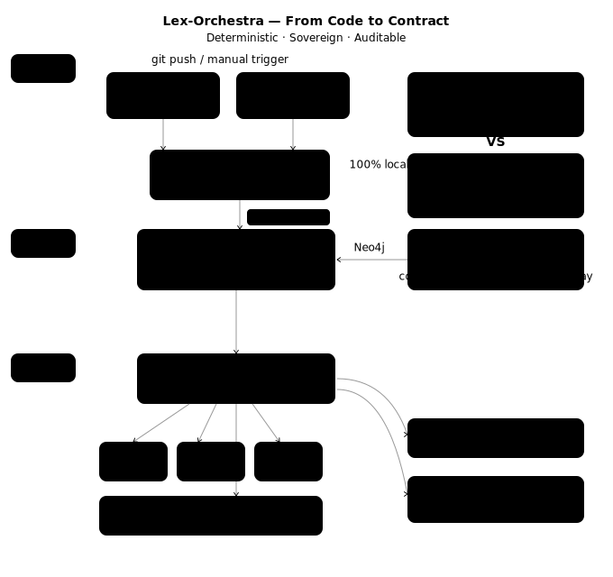
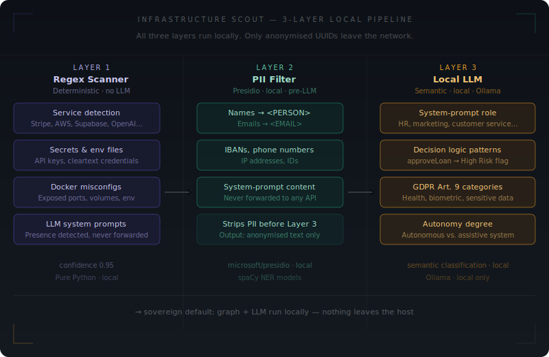

# Lex-Orchestra ⚖️

**Open source compliance infrastructure for regulated software.**  
Reads your codebase. Maps it to the law. Delivers documents ready for legal review.

[](LICENSE)
[]()
[]()

> Your source code never leaves your network.  
> Fully local if you need it. Hybrid if you want it.

---

## What it does

You use Stripe and Supabase. Your system includes an AI component with a system prompt.

Lex-Orchestra scans the repository and delivers:

```
Stripe detected       → GDPR Art. 44 (international transfer)
                      → Standard Contractual Clauses required
                      → DPA missing — signing link included

Supabase detected     → GDPR Art. 28
                      → DPA missing — signing link included

System prompt found   → EU AI Act Art. 52 (transparency obligation)
                      → AI Act Manifest required
                      → Risk level: limited

3 documents generated. Ready for review.
```

Lex-Orchestra turns your codebase into compliance decisions.

Before your coffee gets cold —  
pre-filled drafts are ready for legal review.  
Not a substitute for legal advice.

---

## The gap this closes

Legal teams spend most of their compliance time not on legal judgement — but on reconstruction.  
Which services does the system actually use? What data flows where? Which sub-processors are active?

That information lives in the code. Not in questionnaires. Not in memory.

Traditional compliance tools create a risky gap between the actual, constantly changing infrastructure and static legal documentation. Lex-Orchestra closes that gap — automatically, at scan time, from the source.

The system does not ask what you use. It reads the code and sees it.

---

## How it works



1. **Scan** — reads the repository directly (docker-compose, package.json, .env, Dockerfiles, system prompts)
2. **Detect** — identifies services, sub-processors, AI components, and security signals
3. **Map** — traverses the Context Graph to derive applicable legal obligations
4. **Generate** — renders pre-filled document drafts with source citations

```
Repository (local)
      ↓
   Scout — local detection, three layers, no data leaves the network
      ↓
   Presidio — strips all PII before any external call
      ↓
   Context Graph — maps anonymised signals to GDPR, EU AI Act, ISO 27001, BSI, NIS2, CRA
      ↓
   Document Architect — renders drafts from verified graph paths
      ↓
Documents delivered to legal/ — ready for review, not for discovery
```



---

## The Context Graph

The reasoning engine is a property graph built on Neo4j — not a language model making probabilistic guesses.

Every compliance finding is derived by traversing verified paths between infrastructure nodes and regulatory requirements. If a path exists from a detected service to a legal obligation, the obligation is flagged. If no path exists, nothing is flagged.

The Context Graph reduces the risk of LLM inaccuracies drastically — every document generation is constrained by deterministic paths to official sources. The LLM formats and structures the output. The graph determines what is legally relevant.

GDPR · EU AI Act · CRA · NIS2 · DSA · ISO 27001 · BSI IT-Grundschutz · BSI C5 · BSI AIC4 · OWASP LLM Top 10 · OWASP API Security · NIST CSF 2.0

All seeded from official sources. Every node carries a source reference. Every document carries a confidence score.

→ [Context Graph documentation](docs/architecture/context-graph.md)

---

## For legal and compliance professionals

Lex-Orchestra does not produce legal opinions. It eliminates the discovery phase.

Reviewing a new system today typically means reconstructing: which tools are active, which data flows exist, which sub-processors are involved, which transfer mechanisms apply. That reconstruction takes hours and depends on developers answering correctly from memory.

Lex-Orchestra delivers that reconstruction automatically — sourced directly from the infrastructure. The legal team receives pre-filled drafts with citations, not blank templates. The job shifts from data collection to review and judgement.

**Documents generated today:**

AVV / DPA · TOM · RoPA (Art. 30 GDPR) · SCC · AI Act Manifest

Every document includes a confidence score, a disclaimer confirming draft status, and source traceability to the applicable regulation.

---

## For engineers

One command. Documents in `legal/`. No Word files.

```bash
lex-orchestra scan --repo ./my-project
```

The Scout detects 50+ services automatically — Stripe, AWS, Postmark, OpenAI, and others — including a direct DPA signing link for each processor. Three detection layers run locally: regex pattern matching, Presidio PII filtering, and semantic classification via a local LLM. Only anonymised UUIDs leave the machine.

**Deployment:**

**Hybrid (default)** — Scout and PII filtering run locally. Only anonymised UUIDs and abstract asset types reach external services — never source code, secrets, or real infrastructure details. The privacy boundary is identical to fully local mode. Compliance reasoning and document drafting use external APIs.

**Fully local** — all components in Docker on your own infrastructure, including LLM and graph database. Zero external APIs. Requires 16 GB RAM.

---

## Data boundary

| Stays local — always                | External services receive                                    |
| ----------------------------------- | ------------------------------------------------------------ |
| Source code and repository          | Neo4j: anonymised UUIDs and abstract asset types only        |
| docker-compose, .env, Dockerfiles   | LLM API: anonymised structural context only                  |
| PII filtering and classification    | Example: "Service type: payment (USA), requires DPA and SCC" |
| Generated documents (DPA, TOM, SCC) | Never: file names, variables, code, secrets, IP addresses    |
| Scan results and project state      |                                                              |

Data sovereignty is not a policy statement. It is an architectural constraint.

→ [Data sovereignty — what stays where](docs/architecture/data-sovereignty.md)

---

## Why open source

Compliance should not depend on black boxes.  
It should be inspectable, verifiable, and open.

Regulation defines obligations — but how those obligations are derived should be transparent.

Lex-Orchestra is built as open compliance infrastructure:

- every mapping is visible
- every decision is traceable
- every component can be inspected

AGPL-3.0 ensures that improvements remain open. Anyone who takes this code, modifies it, and offers it as a service must publish their changes. The compliance logic stays open.

Grounded in European regulation and aligned with global standards like ISO 27001, NIST, and OWASP.

The graph schema, scanner logic, document templates, and all architecture decision records are open source.  
Curated control mappings, DPA registries, and jurisdiction layers are available under a commercial license.

---

## Comparison

|                     | Questionnaire tools | Cloud LLM tools  | Code upload tools | Lex-Orchestra                    |
| ------------------- | ------------------- | ---------------- | ----------------- | -------------------------------- |
| Source of truth     | Human memory        | Training data    | Uploaded code     | Live repository                  |
| Reasoning           | Manual input        | Probabilistic    | Probabilistic     | Deterministic graph              |
| Code leaves network | N/A                 | Yes              | Yes               | Never                            |
| Auditability        | None                | None             | None              | Full — every finding traceable   |
| Output              | Checklist           | Text suggestions | Text suggestions  | Pre-filled drafts with citations |

---

## Status and roadmap

**Operational today:** Full pipeline — scan, graph reasoning, 7 document types, Telegram and web UI delivery.

**Next:** Legal News Scanner — monitors regulatory updates and matches them against your specific stack. CI/CD hook for GitHub Actions. PDF output.

**Further ahead:** US law coverage, additional jurisdiction layers, content engine for verified legal updates.

Status: Pre-release · License: AGPL-3.0

---

---

## Learn more

- [Context Graph deep dive](docs/architecture/context-graph.md)
- [Data sovereignty — what stays where](docs/architecture/data-sovereignty.md)
- [Interactive architecture preview](https://lex-orchestra.com)
- [Graph visualizer](https://lex-orchestra.com/architecture/graph-visualizer)

---

> Lex-Orchestra automates compliance preparation — not legal judgement.  
> Generated documents are structured drafts based on infrastructure analysis and a regulatory knowledge graph.  
> They do not constitute legal advice and require review by a qualified legal professional before use or filing.

AGPL-3.0 · Built by [Thomas Rehmer](https://x.com/thomas_rehmer) · [awareo.io](https://awareo.io) · Neo4j · LangGraph · Presidio · Ollama
