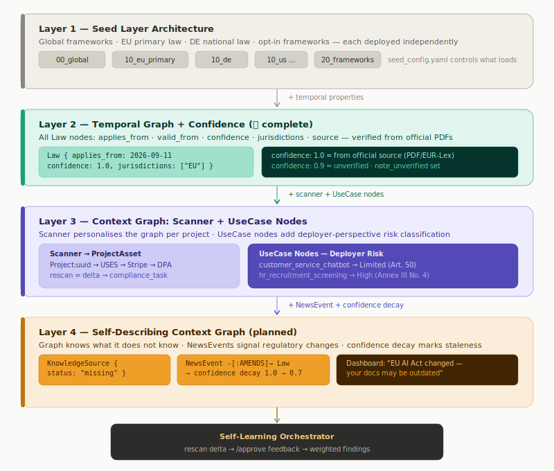
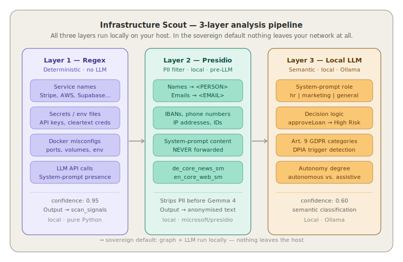

<p align="center">
  
</p>

# Lex-Orchestra

[](LICENSE)
[]()
[]()

<!-- tagline slot — final one-liner pending (Thomas' call); replace the two lines below when it lands -->
**Local compliance agent for software teams.**
From git push to legal draft — on your own hardware.

A single line of code can trigger a GDPR violation that costs your company millions.
Most developers find out months later — from a lawyer.

Lex-Orchestra scans your code repository, detects which laws apply, and generates
pre-filled legal documents — DPA, TOM, records of processing, DPIA, SCC assessment,
AI Act manifest and more — automatically, in German and English.
Your source code never leaves your network. Not as a policy. As an architectural constraint.

One scan. Nine document types. Two languages. Fully local.


Built for the developers and DevOps teams who own the infrastructure — a documented
starting point to take to a lawyer, not a substitute for one. Lex-Orchestra proves what
it can from your code and marks the rest as gaps; it never fills a blank with a guess.
That is deterministic groundwork, not a legal opinion. Once a qualified professional
reviews and signs off, the responsibility is theirs.

[The problem](#the-problem) · [Quickstart](#quickstart) · [In practice](#what-it-looks-like-in-practice) · [Data boundary](#data-boundary) · [Comparison](#how-lex-orchestra-compares) · [Knowledge graph](#whats-in-the-knowledge-graph) · [How it works](#how-it-works) · [Why open source](#why-open-source) · [Repository structure](#repository-structure) · [Documentation](#documentation) · [Status and roadmap](#status-and-roadmap)

## The problem

Every current approach to software compliance is broken. Questionnaire tools ask you to
describe your infrastructure from memory — you forget the analytics pixel you added in
March, and the tool has no way to know. Cloud-based LLM tools guess compliance
probabilistically — an AI that is "85% confident" about a legal requirement is not an
auditable answer, it is a liability. Code upload tools ask you to hand your IP and
secrets to a third party to check for privacy violations — you violate data sovereignty
to verify data sovereignty.

With Lex-Orchestra, legal moves into the pipeline — at commit time, not after
deployment. The legal team's job shifts from data collection to review and sign-off.

In code we trust. The infrastructure speaks for itself.

## Quickstart

Full setup guide: **[docs/setup/README.md](docs/setup/README.md)** · tested on
x86_64 Linux with Docker; 16 GB RAM recommended. aarch64 is untested — the base
images are multi-arch, so it should build, but there is no verified run yet.

```bash
git clone https://github.com/thomasbln/Lex-Orchestra.git
cd Lex-Orchestra

# Configure environment (fill in the __SET_ME__ values)
cp docker/envs/.env.sovereign docker/envs/.env

# Create the shared network + start the stack (sovereign: local Neo4j + Ollama)
docker network create docker_lex-net
cd docker && docker compose --profile with-neo4j --profile with-ollama up -d && cd ..

# Pull the local inference model — 9.6 GB, one-time.
# Expect ~10–15 minutes on a typical connection; check progress with:
#   docker exec ollama ollama list
docker exec ollama ollama pull gemma4:e4b

# Apply the database schema + seed the knowledge graph (host venv)
python3 -m venv .venv && .venv/bin/pip install -r requirements.txt
make db-migrate      # relational schema (projects, scans, documents)
make seed-all        # knowledge graph (layer manifest + modules + validator)

# Validate graph invariants
make seed-validate
```

When the last step finishes it prints your dashboard URL — open it, create a project, and run the first scan.

**What to expect:** the first scan on CPU-only hardware takes a few minutes — measured
4 min 02 s end-to-end on a 12-core mini PC (no GPU), including local LLM
classification and rendering of all nine documents. The status page tracks each step
live; nothing is hanging.

### Uninstall

Lex-Orchestra leaves nothing behind outside its clone directory — no configs in your
home directory, no system services, no cron jobs (the optional systemd autostart unit
is only installed if you copied it yourself — disable it first if you did).

```bash
cd docker && docker compose --profile with-neo4j --profile with-ollama down -v
# removes containers, network, and ALL volumes — including the graph and the model
docker network rm docker_lex-net 2>/dev/null || true   # compose leaves this one: it is declared external
# optional: images too
docker images -q --filter=reference='docker-*' --filter=reference='ollama/*' --filter=reference='neo4j*' | xargs -r docker rmi -f
cd .. && cd .. && sudo rm -rf Lex-Orchestra
```

The `sudo` is honest, not lazy: the database volume directory (`pgdata`) and generated
`legal/` files are written by containers and end up root-owned on the host. If you
prefer to avoid sudo, delete them from a throwaway container first.

**In a hurry?** The same four steps as one line:

```bash
(cd docker && docker compose --profile with-neo4j --profile with-ollama down -v; docker network rm docker_lex-net 2>/dev/null; docker images -q --filter=reference='docker-*' --filter=reference='ollama/*' --filter=reference='neo4j*' | xargs -r docker rmi -f); cd .. && sudo rm -rf Lex-Orchestra
```

Run it from the clone directory. It removes the images too, so the next install
re-pulls and re-builds from scratch — including the language model, which is the
slow part.

### Security posture (self-hosters)

The backend API (`approve_api`, port **8001**) and the dashboard (port **3000**)
are **unauthenticated by design** — Lex-Orchestra is built for a trusted
private network (LAN/VPN). Anyone who can reach port 8001 can trigger scans,
edit measures and re-render documents. Before deploying:

- Bind the services to `localhost` or a private interface — **never expose
  ports 8001/3000 directly to the internet.**
- For remote access, put an authenticating reverse proxy (Basic Auth, OIDC,
  Tailscale/VPN) in front.
- The internal LangGraph engine (port 8000) is not published outside the
  container at all; the only built-in guard is the internal `X-Scan-Secret`
  header on the scan step endpoint.

## What it looks like in practice

You use Stripe and Supabase. Your system includes an AI component.

```
Stripe detected       → GDPR Art. 44 ff. (third-country transfer)
                      → Standard Contractual Clauses assessed
                      → DPA missing — signing link included

Supabase detected     → GDPR Art. 28 (processor)
                      → DPA missing — signing link included

AI service detected   → EU AI Act Art. 50 (transparency obligation)
                      → AI Act manifest + AI policy generated
                      → Risk level: limited
```

Nine documents generated, in German or English. Ready for review. They land in
`legal/drafts/` as Markdown and PDF, with a per-document provenance logbook. The
dashboard (port 3000) shows scan status, gaps with fix links, and lets you edit the
technical-measures catalogue before re-rendering.

## Data boundary

| Stays local (always) | Optional cloud graph receives (anonymised only) |
|---|---|
| Source code and git repository | UUIDs and abstract asset types |
| docker-compose, .env, Dockerfiles | — |
| Generated legal documents + PDFs | — |
| Scan results and project state (Postgres) | — |
| LLM classification (Ollama, local) | — |
| Real file names, variables, secrets | Never sent anywhere |

In the default sovereign profile there is no cloud component at all.

## How Lex-Orchestra compares

| Dimension | Typical compliance tools | Lex-Orchestra |
|---|---|---|
| How it decides | LLM guesses probabilistically | Context Graph traverses deterministically |
| Where your code goes | Uploaded to cloud for analysis | Never leaves your network |
| When compliance happens | Legal reviews after deployment | Integrated at commit time |
| What you get for a missing DPA | "You need a DPA with Stripe" | Pre-filled DPA draft with direct signing link |
| How often it runs | Once a year, maybe | Re-scan on demand, delta on every run |
| Auditability | Black box — no trace | Every finding traceable to a graph node and source |

## What's in the knowledge graph

| Content | Coverage | Source |
|---|---|---|
| GDPR, EU AI Act, NIS2, CRA, DORA, DSA + German national law (BGB, UWG, TTDSG, PAngV, DDG) | 55+ law articles with enforcement dates | EUR-Lex / official texts |
| BSI IT-Grundschutz | 22 controls (titles + mappings; full requirement texts are license-gated — bring your own Kompendium copy) | BSI |
| NIST CSF 2.0 | 12 functions/categories | NIST |
| OWASP Top 10 (Web, LLM, API) | 30 controls | OWASP |
| EU AI Act use cases | 20 (Annex III + Art. 5 prohibited) | EUR-Lex |
| Services | 67 curated processors with DPA links, data categories, deletion periods | provider trust pages, DPF list |

ISO 27001, BSI C5 and BSI AIC4 are **bring-your-own-standard**: the content is
license-gated, so the repo ships the seed slots but not the licensed texts.
Every node and relationship carries source, license and last-verified provenance.



## How it works

```
git push  -->  Scout (local)  -->  Context Graph (local)  -->  Documents  -->  Dashboard
                    |
          Source code never leaves your network
```

### The Scout

The Scout reads your repository directly — docker-compose files, package manifests
(npm, pip, poetry, composer, go), .env patterns, Dockerfiles. It detects services
automatically against a curated catalogue of 67 processors, including a direct link
to each processor's DPA signing page. No forms. No memory. The code is the real data
flow. The Scout does not ask what you use. It sees it.

<picture>
  <source media="(prefers-color-scheme: dark)" srcset="docs/images/architecture-scout-layers-dark.svg">
  
</picture>

### The Context Graph

The Context Graph is not a feature. It is the engine that makes the whole system work.
Built on Neo4j (a local container by default), it maps your infrastructure to legal
requirements deterministically. It does not guess. Every finding is traceable to a
specific node and an official source — the graph either finds a path from your detected
component to a legal requirement, or it does not.

The default profile is fully sovereign: Neo4j and the LLM both run locally, documents
are assembled deterministically from the graph, and nothing leaves your network. This
is not a privacy policy. It is an architectural constraint.

The detection layers, enforcement dates, jurisdiction layers, provenance and the
provider/deployer risk split are documented in
[context-graph.md](docs/architecture/context-graph.md); the data zones and the
UUID-only pattern in [data-sovereignty.md](docs/architecture/data-sovereignty.md).

## Why open source

Compliance should not depend on black boxes. Regulation defines obligations — but how
those obligations are derived should be inspectable, verifiable, and open: every mapping
visible, every decision traceable, every component inspectable.

AGPL-3.0 ensures that improvements remain open. Anyone who takes this code, modifies it,
and offers it as a service must publish their changes. The compliance logic stays open.

The graph schema, scanner logic, and document templates are open source. Curated control
mappings, DPA registries, and jurisdiction layers are available under a commercial
license.

## Repository structure

```
src/          application code — scanner, graph client, document builders, dashboard
  graph/        Neo4j client + seed layers (the knowledge graph)
  scanner/      repository scan, service detection, gap analysis
  documents/    builders: graph data → content models
  templates/    Jinja2 document templates (de/ and en/)
  workflow/     LangGraph pipeline
  interface/    approve_api (FastAPI)
  dashboard/    Next.js UI
tests/        test suite
scripts/      operational tooling — seeding, migrations, export
docker/       compose files, per-service Dockerfiles, env templates
supabase/     relational schema migrations
docs/         documentation (setup, architecture, reference, principles)
legal/        generated documents — runtime output, starts empty
logs/         scan logs and graph write history — runtime output, starts empty
```

## Documentation

| Section | Description |
|---|---|
| [docs/setup/](docs/setup/) | Hardware, credentials, Docker, troubleshooting |
| [docs/architecture/context-graph.md](docs/architecture/context-graph.md) | Context Graph deep dive: from RAG to GraphRAG to Context Graph |
| [docs/architecture/data-sovereignty.md](docs/architecture/data-sovereignty.md) | Data sovereignty: the three zones, the UUID-only pattern, and the threat model it defeats |
| [docs/architecture/trust.md](docs/architecture/trust.md) | Trust statement: verifiable claims, not promises |
| [docs/reference/](docs/reference/) | Service registry, scan strategy |

## Status and roadmap

**Operational today:** full pipeline — repository scan, deterministic graph matching,
nine document types (DPA/AVV, TOM, records of processing, DPIA, SCC assessment,
AI policy, AI system documentation, AI Act manifest, scan report) in German and
English, Markdown + PDF, per-document provenance logbook, editable measures
catalogue, live scan status page.

**Next:** a Legal News Scanner that alerts you when regulatory changes affect your
specific stack, a CI/CD hook for GitHub Actions, and webhook notifications.

**Further ahead:** US law coverage and additional jurisdiction layers.

Release: v1.0.0 · License: AGPL-3.0 · Partner access: [open an issue](https://github.com/thomasbln/Lex-Orchestra/issues)

---

> Generated documents are pre-filled drafts. Built directly from your infrastructure
> scan and knowledge graph. Each document must be reviewed by a qualified legal
> professional before use or filing.

AGPL-3.0 — Built by Thomas Rehmer — Neo4j — LangGraph — Ollama
